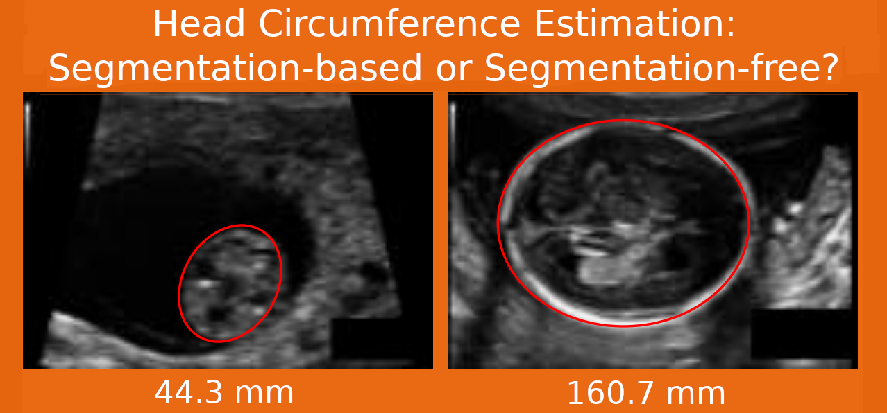

# HC-reg-seg

Fetus head circumference (HC) estimation from ultrasound images via segmentation-based and segmentation-free approaches.    
---
    
⭐ The highlight of this work:
* The HC is estimated via segmentation-based and segmentation-free approaches respetively;
* Methodology on evaluating the segmentation-based and segmentation-free methods;
* The evaluation of two approaches is performed under a **fair experimental environment**. 

👉 We evaluated both two types of approaches in several aspects:    
* The architectures (Memory, Parameters);     
* The prediction accuracy;
* Agreement analysis;
* Saliency maps;
* Actual inference time and memory cost;
* Comparison with state-of-the-art.

💻 About the code:    

The code is implimented with Python 3.* and Deep learning library Tensorflow (Keras 2.*).

---
The work is finished together with [Caroline Petitjean](http://pagesperso.litislab.fr/cpetitjean/) and [Samia Ainouz](https://pagesperso.litislab.fr/sainouz/) in [LITIS](https://www.litislab.fr/) lab.
